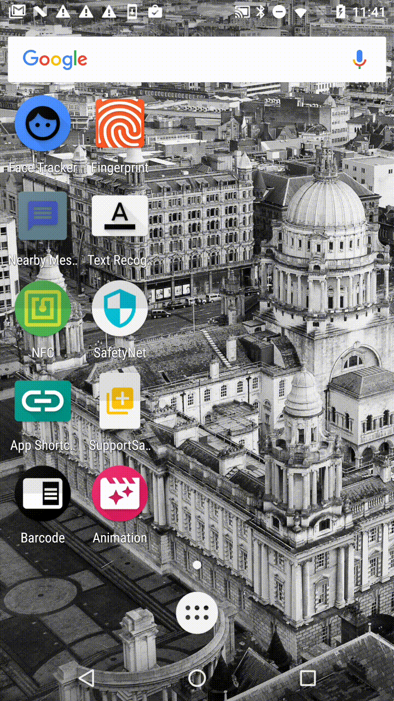
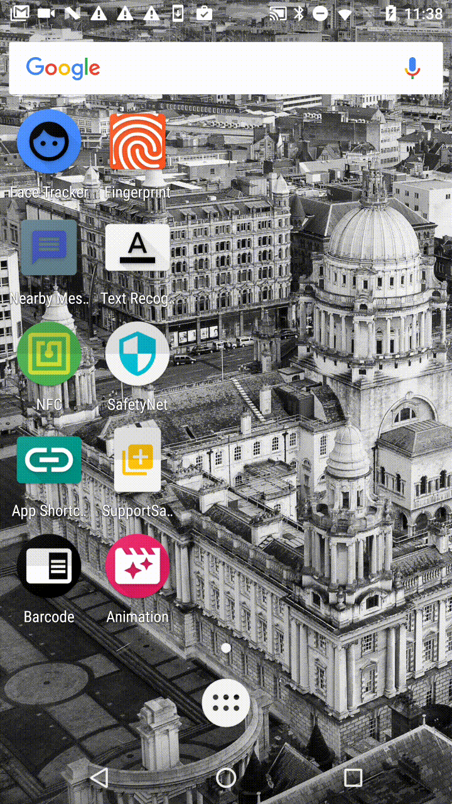

# android-playground
android-playground

## animation

Lollipop以降に登場したいろいろなアニメーションの実装サンプルになります。

## app_shortcuts

[App Shortcuts](https://developer.android.com/guide/topics/ui/shortcuts.html)のサンプルです。

## barcode

[Barcode API](https://developers.google.com/vision/android/barcodes-overview)のサンプルです。

## face

[Face Api](https://developers.google.com/vision/face-detection-concepts)のサンプルです。
顔認識用のアプリです。

## fingerprint

指紋認証APIのサンプルです。

## nearbymessages

[Nearby Messages API](https://developers.google.com/nearby/messages/overview)のサンプルです。

## nfc

NFC APIのサンプルです。

## safetynet

[SafetyNet](https://developers.google.com/android/reference/com/google/android/gms/safetynet/SafetyNet)のサンプルです。
アプリケーションをインストールすると、インストールした端末がルート化されているかなどを判断するための情報が表示されます。

## supportsample

あまりメジャーではないサポート系ライブラリ内のAPIのサンプルです。

## textrecognizer
[TextRecognizer](https://developers.google.com/android/reference/com/google/android/gms/vision/text/TextRecognizer)のサンプルです。

## lifecycles
[Lifecycles](https://developer.android.com/topic/libraries/architecture/lifecycle.html)のサンプルです。
使い所としては以下ような使い方で効果を発揮すると思われます。
- FragmentとActivity間のデータ通信(ActivityとActivityは不可)したい場合に簡単に同期できる
- データを監視ができるので、Web APIやデータアクセス時のコールバックを簡易に行える
- 画面オリエンテーションを行う場合のデータ復元などが簡単に行える
- ライフサイクルごとに管理が必要なLocationManagerをActivity毎に一々LocationManager#requestLocationUpdatesしたり、LocationManager#removeUpdatesしていたものを、
ライフサイクルを内包した独自クラスを定義することで一元管理できる

