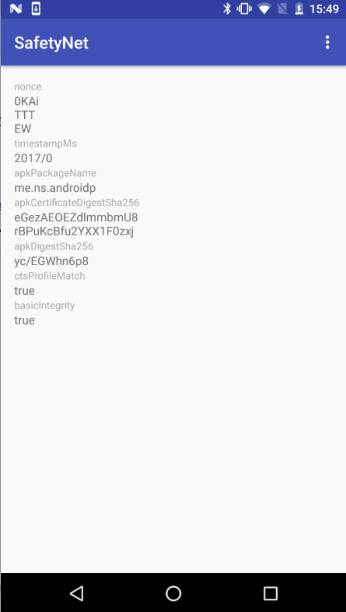

# android-playground
android-playground

## app_shortcuts

[App Shortcuts](https://developer.android.com/guide/topics/ui/shortcuts.html)のサンプルです。

## safetynet

[SafetyNet](https://developers.google.com/android/reference/com/google/android/gms/safetynet/SafetyNet)のサンプルです。
アプリケーションをインストールすると、インストールした端末がルート化されているかなどを判断するための情報が表示されます。

## face

[Face Api](https://developers.google.com/vision/face-detection-concepts)のサンプルです。
顔認識用のアプリです。

